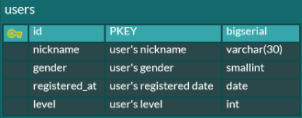
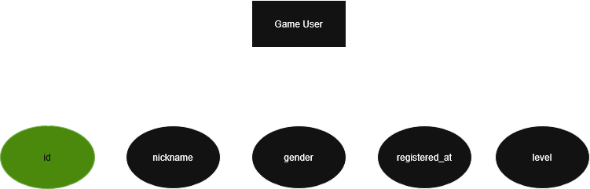

# 테이블의 모든 엔티티와 속성
```
[User]
- id
- nickname
- gender
- registered_at
- level
```

# ERD 작성


# 객체-관계 모델 작성


# SQL
[click here](../code/chp2/week2.sql)

# 개념퍼즐
1. 개념적모델링
2. 논리적모델링
3. 데이터모델
4. 데이터모델링
5. 물리적모델링
6. 트랜잭션
7. 확장성
8. 무결성

# 연습문제
1. 현실 세계의 데이터는 사람의 오감으로 인지할 수 있는 실체로, 둘 이상의 특성으로 구성된 __개체__로 표현된다.
2. 개념 세계의 데이터는 개체의 의미로부터 인식된 개념으로, 둘 이상의 속성으로 구성된 __개체 타입__으로 표현된다.
3. 현실 세계의 직장인이 속한 세계에 따라 구분되는 구성 요소를 5개 이상 작성하시오.

| 구분                           | 구성요소                                                    |
|------------------------------|---------------------------------------------------------|
| 현실 세계의 직장인                   | 이름, 직장명, 나이, 직위, 근속년수                                   |
| 회사라는 개념 세계의 직장인              | 이름, 부서명, 나이, 연락처, 급여                                    |
| 자동차 보험사라는 개념 세계의 직장인         | 이름, 고객명, 연락처, 부서명, 영업건수                                 |
| 회사라는 개념 세계와 대응하는 컴퓨터 세계의 직장인 | 이름(문자 20자리), 사번(숫자 10자리), 부서명(문자 20자리), 급여(정수), 입사일(날짜) |

4. 데이터 모델링의 각 단계와 설명을 바르게 연결하시오.
> 답: 1 - c, 2 - a, 3 - b

5. 데이터 모델링을 개념적, 논리적, 물리적 모델링으로 구분해서 수행하는 이유를 설명하시오.
> 답: 복잡한 현실 세계의 데이터를 단계를 거치며 더욱 체계적으로 이해하고 구분하기 위한 용도

6. 개념적 모델링 결과를 DBMS가 직접 이해할 수 없는 이유를 설명하시오.
> 답: DBMS는 논리적 데이터 모델을 기반으로 개발되기 때문

7. 데이터 모델을 구성하는 세 가지 구성 요소를 쓰시오.
> 답: 데이터 구조, 데이터 구조에서 허용되는 연산, 데이터 구조와 연산에 대한 논리적 제약

8. 개념적 데이터 모델의 구성 요소를 쓰시오.
> 답: 개체 타입, 관계

9. 다음 중 데이터베이스를 구축하는 6단계를 바르게 나열한 것은?
> 답: 요구수집 및 분석 - 개념적 설계 - DBMS 선정 - 논리적 설계 - 물리적 설계 - 구현 및 테스트

10. 다음 중 DB설계 전략에 대한 설명이 잘못된 것은?
> 답: 데이터 중심 설계와 처리 중심 설계 가운데 하나를 선택해서 진행하는 것이 효율적이다. (실제로는 병행 진행이 더 효율적)

11. 다음 중 데이터베이스 설계 시 고려 사항에 대한 설명이 잘못된 것은?
> 답: 확장성: 시스템 운영을 일시 중단하고 새로운 데이터나 응용 프로그램을 추가할 수 있어야 한다. (실제로는 운영 중단이 없어야 함)