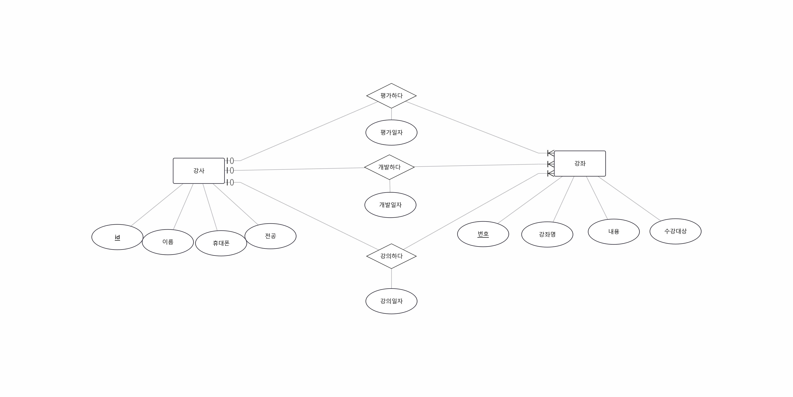
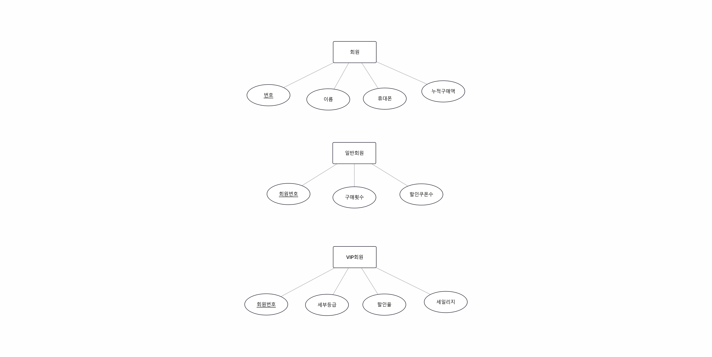
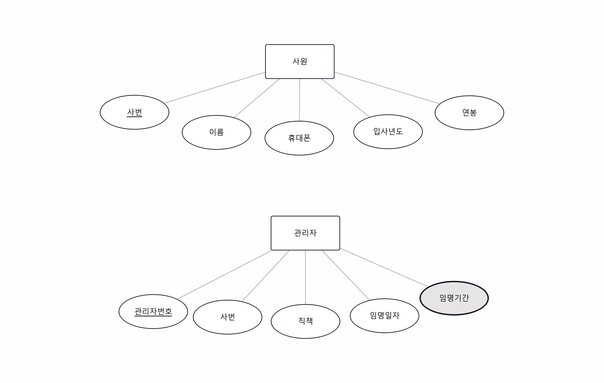
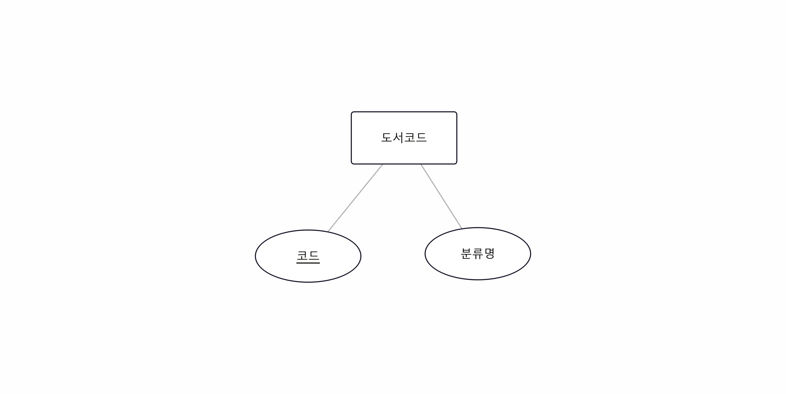

# 십자말풀이
1. 한 개체가 다른 개체가 아닌 자기 자신과 맺는 관계
> 정답: 순환 관계
2. 업무로부터 도출된 일반적인 속성
> 정답: 기초 속성
3. 다른 속성으로부터 계산 등의 가공 처리를 하여 생성된 속성
> 정답: 설계 속성
4. 별개의 개체 타입들의 집합
> 정답: 카테고리
5. 원래는 존재하지 않았지만 필요에 따라 설계자가 추가한 속성
> 정답: 유도 속성
6. 두 개체 간에 존재하는 2개 이상의 관계
> 정답: 병렬(다중) 관계
7. 키 개체 간의 업무적 관련성으로 인해 생성되는 개체
> 정답: 메인 개체
8. 두 개체 간의 M:N 관계로 인해 생성되는 개체
> 정답: 관계 개체
9. 정보를 간단히 표현하기 위한 기호를 나타내는 개체
> 정답: 코드 개체
10. 독립적으로 존재하지 못하고 소유 개체가 있어야 존재할 수 있는 개체
> 정답: 약한 개체
11. 관계를 맺고 있는 두 개체 타입에서 한 개체 타입의 일부 개체 인스턴스만 다른 개체 타입의 개체 인스턴스와 연관되는 것
> 정답: 부분 참여

# 연습문제
1. 다음 중 개체 심화 요소에 대한 설명으로 적절하지 않은 것은?
> 정답: 2
2. 키 개체와 메인 개체의 차이점을 설명하시오.
> 정답: 키 개체는 원래부터 존재하는 것이고, 메인 개체는 이 키 개체 간의 업무적 연관성으로 인해 생성되는 개체임
3. 관계 개체와 메인 개체의 차이점을 설명하시오.
> 정답: 관계 개체는 '키' 개체 간의 관계이며, 메인 개체는 그냥 개체 간의 M:N 관계임
4. 다음과 같은 병렬 관계를 직렬 관계로 변환하여 ERD로 표현하시오.
> 정답: 
5. 괄호 안에 적합한 단어는?
> 정답: 원래 존재하지는 않았으나 필요에 따라 설계자가 추가한 속성을 (유도 속성)이라고 한다.
6. 슈퍼-서브 타입을 정제할 때 어떤 경우에 슈퍼타입 개체를 기준으로 통합하는지 설명하시오.
> 정답: 응용 프로그램에서 서브타입을 구분해 처리하지 않는 경우, 서브타입 개체에 속하는 데이터를 명확히 구분하기 어려운 경우, 서브타입 개체에 포함되는 속성 수가 매우 적은 경우
7. 일반회원과 VIP회원을 처리하는 모든 응용프로그램이 명확히 구분되며, 추후 추가될 응용프로그램도 마찬가지다. 아래 슈퍼-서브 타입을 바르게 정제한 결과를 ERD로 표현하시오.
> 정답: 
8. 사원 가운데 일부는 관리자이므로 유일한 관리자번호와 직책, 임명일자, 임명기간 속성이 필요하여 아래와 같이 사원 개체를 표현했는데, 사원 가운데 관리자의 비율은 5% 미만이다. ER모델을 좀 더 효율적으로 정제하여 ERD로 표현하시오.
> 정답: 
9. 다음과 같이 책을 분류하기 위한 도서 코드 개체 타입을 ERD로 표현하시오.
> 도서 코드: 1 - 인문, 2 - 공학, 3 - 미술, 4 - 음악, 5 - 취미, ...\
> 정답: 
> SQL DDL: \
> CREATE TABLE BOOK_CATEGORY ( code INT PRIMARY KEY, name VARCHAR(10) NOT NULL );\
> INSERT INTO BOOK_CATEGORY VALUES (1, '인문'), (2, '공학'), (3, '미술'), (4, '음악'), (5, '취미');
10. 다음 중 속성을 검증하는 방법으로 적절하지 않은 것은?
> 정답: 4